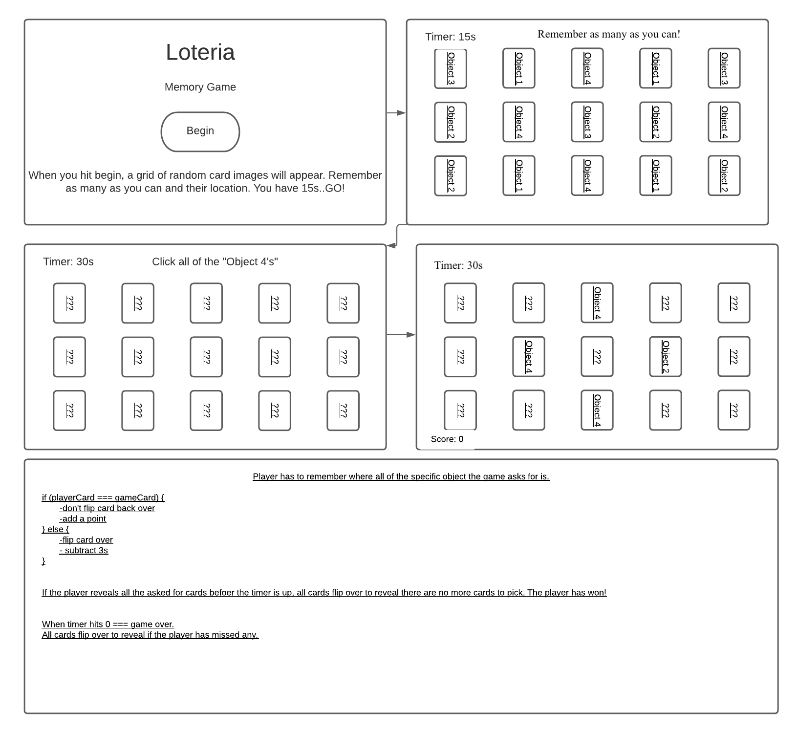
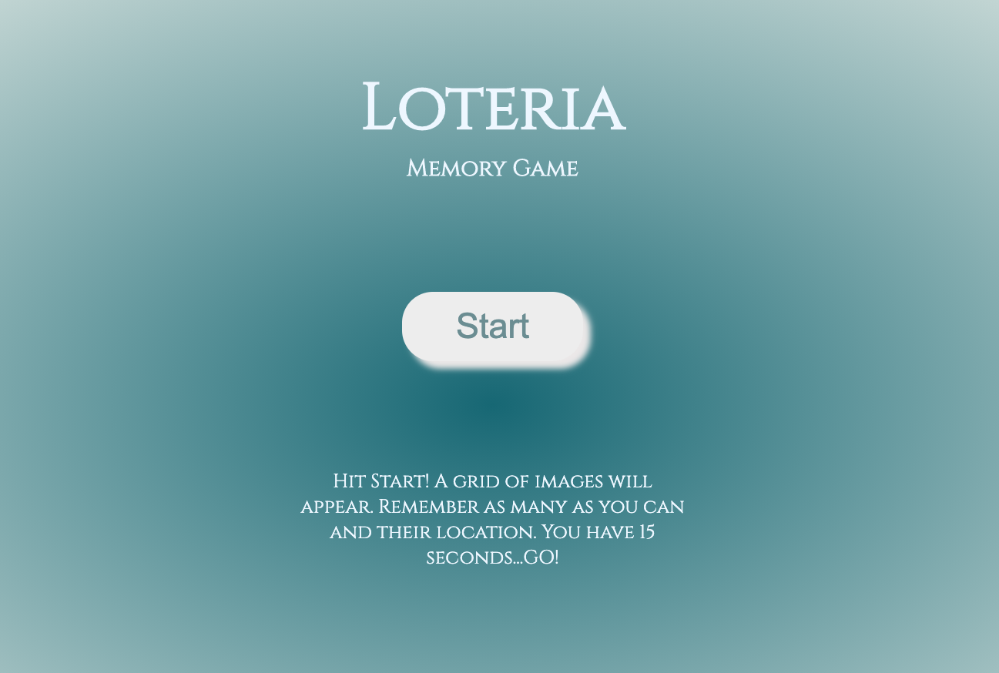
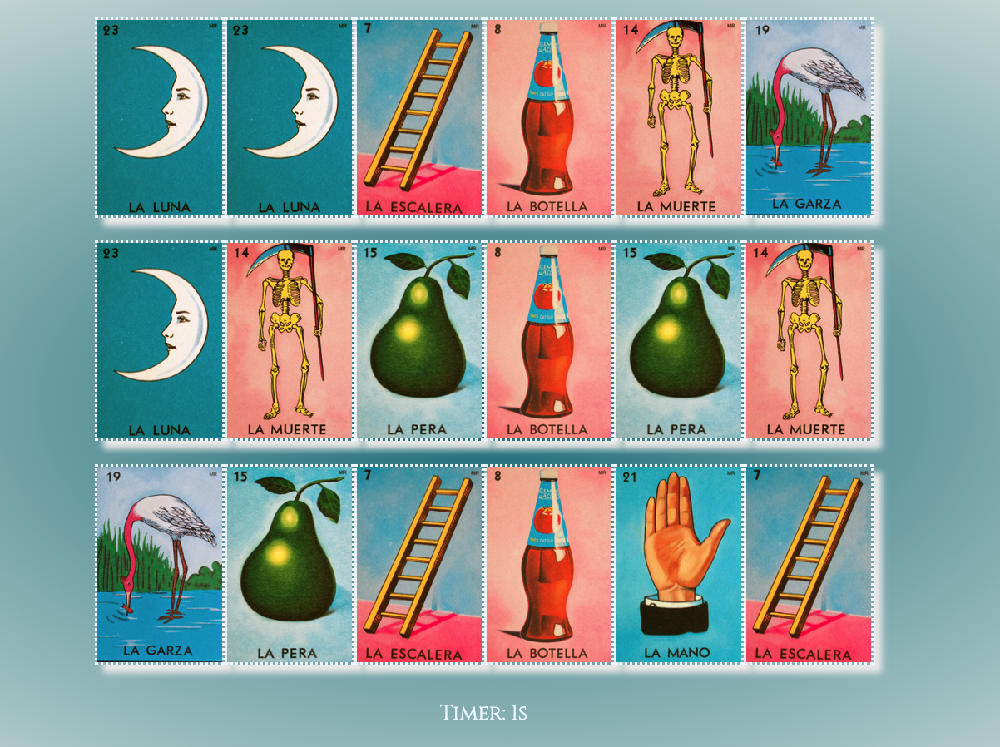
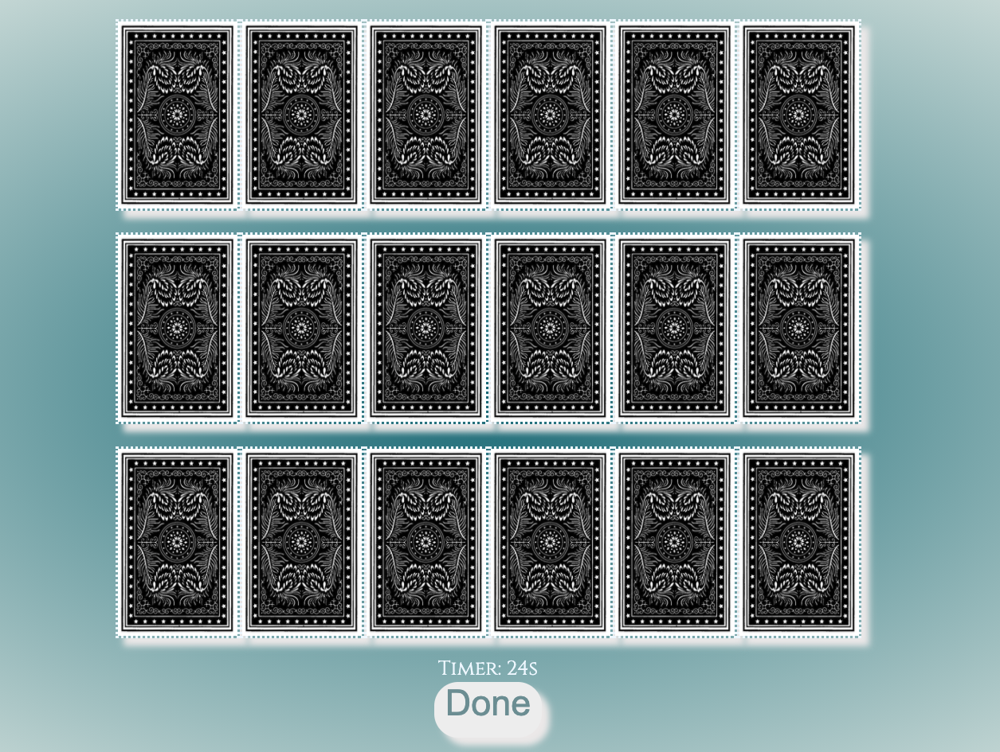
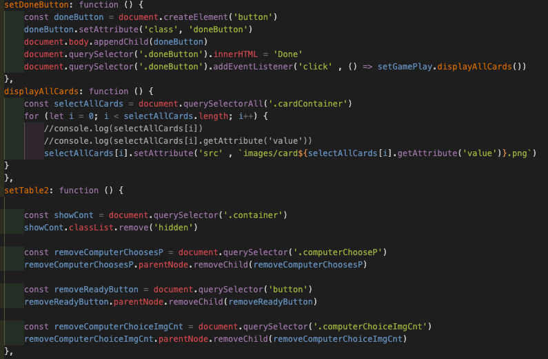

# Loteria Memory Edition

## Loteria Game History
The origin of lotería can be traced far back in history. The game originated in Italy in the 15th century and was brought to New Spain (modern Mexico) in 1769. In the beginning, lotería was a hobby of the upper classes, but eventually it became a tradition at Mexican fairs.

## Motivation
This game was made for my grandma, it is her favorite game, and after her being diagnosed with cancer I wanted to be able to create a new type of game for her to play with the same classic feel.

## Wireframe

## Screen Grabs

## Instructions

Remember where images lay on the grid of cards and how many there are. Click the location of the images the computer asks for when the cards flip over. 

## User Stories/game logic

* User will arrive on landing page, where they will read some simple instructions and click the start button.

* Once the start button has been clicked, 18 cards will appear with an array of different images in a random order.

* The player must rememeber where all the images are in the table and how many there were.

* After 15 seconds the computer will choose a card for the player to have to find.

* The player must flip over all cards of the specific image asked for and hit "Done". They have 30 seconds.

* Once they hit done, all the cards will reveal their images and the player will be able to see if they missed any.

## Technologies Used
* HTML
* CSS
* JavaScript

## Credits
* https://developer.mozilla.org/en-US/
* Jacob Kleiman's "High Card"
* Fellow SEIR-921 students and faculty

## Future Development
* Create a function that counts how many correct cards there are on the board and tally up the total as the play clicks the correct card.
* Animate the flip of the card. 
* Create media queries to allow game play on any size screen.

## Go To Site Live
https://laurennguyen395.github.io/Loteria-Memory-Edition/
